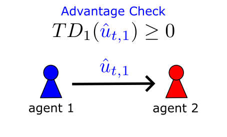
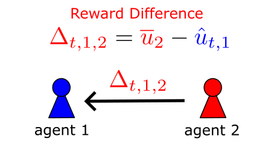
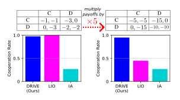
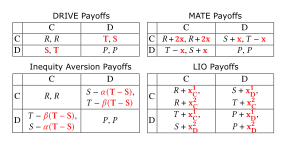
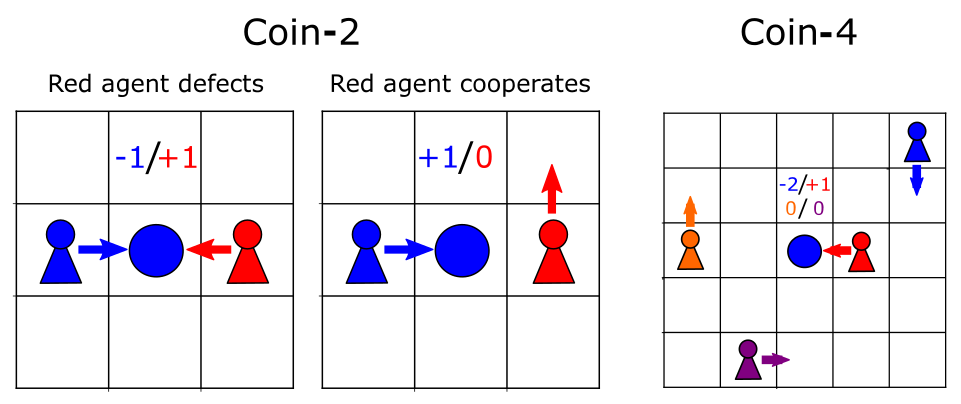
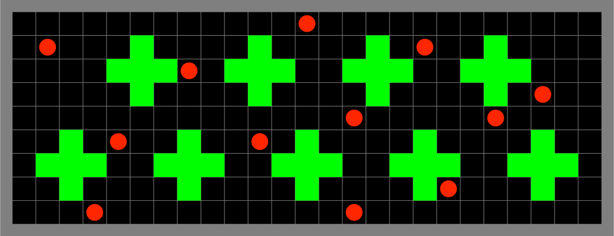
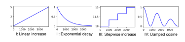
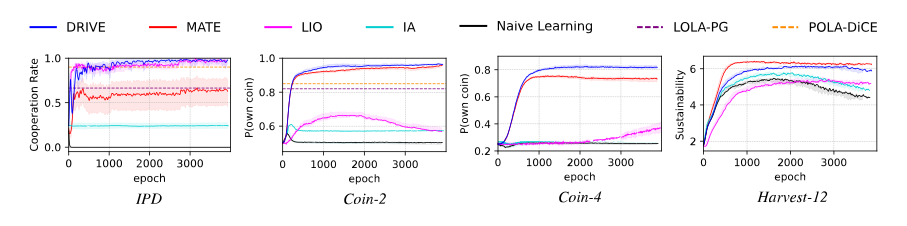
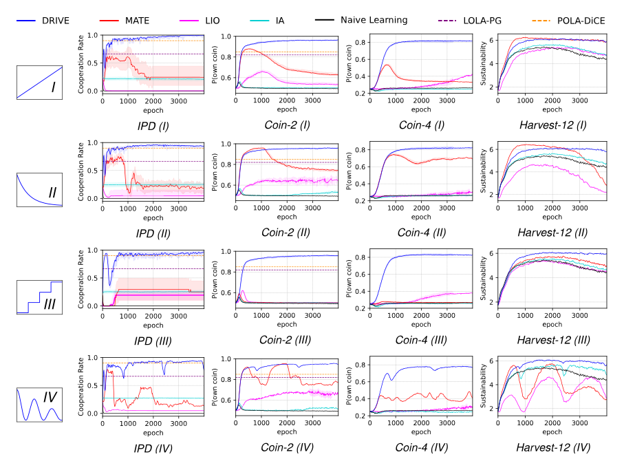

# DRIVE: Dynamic Reward Incentives for Variable Exchange

DRIVE is a decentralized peer-incentivization mechanism for emergent cooperation under changing rewards. It shapes incentives through reciprocal exchange of reward differences, enabling agents to dynamically align on cooperative behavior even when environmental reward scales or offsets drift over time.

---

## 1. Approach at a Glance

DRIVE augments standard independent multi-agent reinforcement learning with a lightweight, local incentive-exchange protocol. Importantly, **DRIVE does not learn incentive values** and does not modify the action space; instead, it reshapes rewards dynamically based on observed outcomes.

| | |
| ------------------------------------------------------------------------------------------------------------------------------------------------------------------------------------- | ----------------------------------------------------------------------------------------- |
| **Advantage gating**: an agent checks whether its temporal-difference (TD) advantage is non-negative before issuing an incentive request, exposing potentially exploitative behavior. | **Reward-difference exchange**: neighbors respond with differences between their epoch-average reward and the received request, ensuring incentives remain proportional and scale-free. |
|  |  |

**Payoff interpretation**: In matrix games such as the Prisoner’s Dilemma, this exchange swaps the temptation and sucker payoffs under unilateral defection, turning cooperation into the individually rational choice without altering environment dynamics.

| | |
| --------------------------------------- | --------------------------------------- |
|  |  |

---

## 2. Domains and Experimental Settings

The implementation reproduces the experimental evaluation from the paper, covering both matrix games and sequential social dilemmas (SSDs):

| Domain     | Label        | Description                     |
|------------|--------------|---------------------------------|
| IPD        | `Matrix-IPD` | Iterated Prisoner’s Dilemma     |
| Coin-2     | `CoinGame-2` | 2-player Coin Game              |
| Coin-4     | `CoinGame-4` | 4-player Coin Game              |
| Harvest-12 | `Harvest-12` | 12-agent Harvest environment    |




### Reward Change (Drift) Functions

To evaluate robustness under changing rewards, experiments apply shared per-epoch affine transformations:

| Drift Function       | Label               |
|----------------------|---------------------|
| No change            | `identity`          |
| Linear increase      | `linear`            |
| Exponential decay    | `exponential_decay` |
| Stepwise increase    | `stepwise_increase` |
| Damped cosine        | `cos_damped`        |



These transformations preserve the strategic structure of the social dilemma while altering reward magnitudes and offsets.

---

## 3. Key Results

- **Robust cooperation under reward drift**: DRIVE consistently maintains high cooperation levels across domains and reward-change schedules.
- **Scale and shift invariance**: Unlike prior peer-incentivization methods with fixed incentives or learned incentive functions, DRIVE remains effective without retuning.
- **Competitive baseline performance**: In static settings, DRIVE matches or exceeds state-of-the-art peer-incentivization methods, while significantly outperforming them when rewards change.




---

## 4. Implemented MARL Algorithms

The repository includes the following algorithms for comparison:

| Algorithm                  | Label      | Notes                                   |
|----------------------------|------------|-----------------------------------------|
| Random policy              | `Random`   | Non-learning baseline                   |
| Naive independent learning | `IAC`      | Policy gradient with normalized returns |
| LIO                        | `LIO`      | Learned incentive function              |
| MATE                       | `MATE-TD`  | Fixed-token peer incentivization        |
| DRIVE                      | `DRIVE-TD` | Dynamic reward-difference exchange      |

Non-PI baselines (e.g., Naive Learning) are invariant to reward drift due to return normalization, but do not resolve incentive misalignment in social dilemmas.

---

## 5. Experiment Parameters

Global experiment parameters such as the learning rate (`params["learning_rate"]`) or the number of episodes per epoch (`params["episodes_per_epoch"]`) are defined in `settings.py`.

Algorithm-specific hyperparameters are implemented in `src/controllers`, with default values matching those reported in the technical appendix of the paper. All parameters can be overridden via the `params` dictionary in `settings.py`.

---

## 6. Prerequisites and Installation

**Prerequisites**:

- Python 3.8+
- `pip` or compatible package manager
- Optional: CUDA-enabled GPU for PyTorch acceleration

**Installation**:

```bash
python -m venv .venv
source .venv/bin/activate
pip install -r requirements.txt
```

---

## 7. Training

To train algorithm `M` (see Section 4) in domain `D` (Section 2) under reward drift function `X`, run:

```bash
python train.py D M X
```

This creates an output directory of the form `output/N-agents_domain-D_drift-X_M_datetime` containing trained models (if applicable) and training statistics as JSON files.

The script `run.sh` reproduces the full experimental sweep reported in the paper.

---

## 8. Code Structure

The core DRIVE mechanism is implemented in:

```sh
src/controllers/drive.py
```

This module contains the TD-gated request/response protocol and the reward shaping rule based on reciprocal reward differences.
